### BlogApp - ASP.NET Core MVC Blog Projesi

---

#### Demo - unlisted

https://www.youtube.com/watch?v=CxG-fNDaWIY

---

#### Tech Stack

- **PostgreSQL**
- **Asp.Net Core MVC**
- **Microsoft Identity**
- **EF Core**
- **Postgress App**
- **TablePlus**
- **Scaffolded UI Identity**
- **Libman**

---

#### Proje Ayrıntıları

1) ✅ **Kullanıcı Yönetimi (Authentication & Authorization)**
	•	Kullanıcılar sisteme kayıt olabilir, giriş yapabilir ve çıkış yapabilir.
	•	Sadece giriş yapan kullanıcılar yeni blog yazısı ekleyebilir, düzenleyebilir ve silebilir.
	•	Misafir kullanıcılar sadece blog yazılarını okuyabilir.
	•	Yorumlar sadece giriş yapmış kullanıcılar tarafından yapılır.
	•	Blog yazıları için görsel yükleme özelliği eklenildi.

2) 📝  **Blog Yönetimi**
	•	Blog yazıları için CRUD (Create, Read, Update, Delete) işlemleri yapıldı.
	•	Bir blog yazısı içeriği model resmi aşağıda bulabilirsiniz.

3) 📁 **Veri Tabanı Yapısı**
	•	Entity Framework Core kullanılarak veri tabanı bağlantısı kuruldu.
    •	PostgresApp - TablePlus bağlatısı kuruldu(Ayrıntısı aşağıda)
	•	Migrations kullanılarak veri tabanı oluşturuldu.
	•	Blog yazılarına örnek test verileri verildi.

4) 🎨 **Sayfa Yapısı ve Tasarım**
	•	Razor Pages kullanıldı (Identity scaffold)
	•	Bootstrap kullanılarak responsive bir tasarım yapıldı.
	•	Layout, Partial Views ve Sections kullanıldı.
	•	Blog detay sayfası (Details Page) yapıldı.
	•	Blog yazıları anasayfada listelendi, kategori filtresi yapıldı.

5) 💬 **Form İşlemleri ve Validations**
	•	Yeni blog ekleme, düzenleme ve kullanıcı kayıt/giriş formlarında Model Validations yapıldı.
	•	Hatalar kullanıcıya gösterildi.

6) 📁 **Seed Data**
	•	Örnek kullanıcılar, postlar ve yorumlar hazır olarak gelir. Detayı aşağıda en son migration'da resimli halini bulabilirsiniz

	•	Kullanıcı bilgileri:
		•	demo@example.com - PostId-99
		•	user2@example.com - PostId-100

#### Models

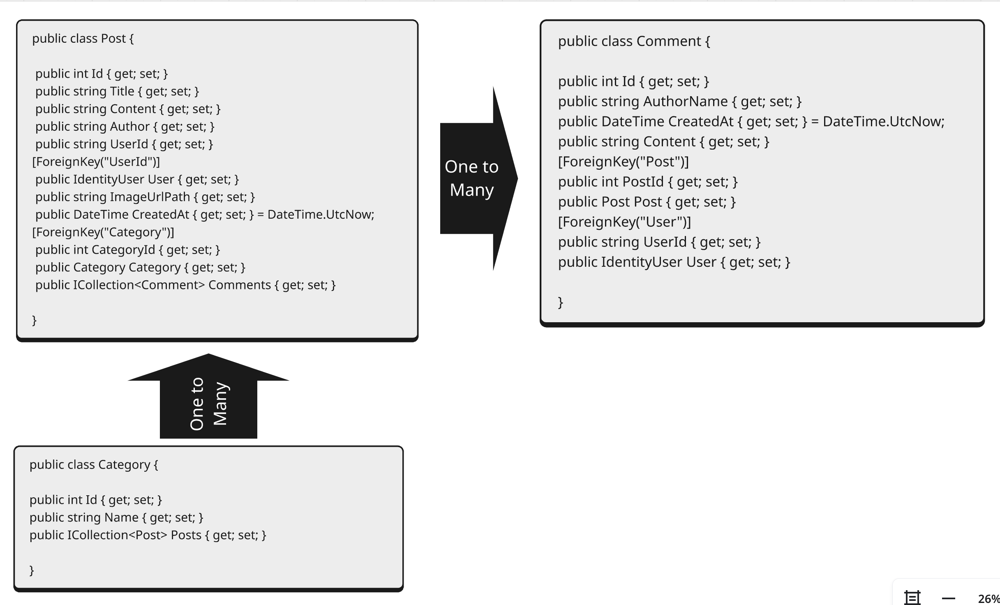

#### Migrations & Details

- **InitialCreateWithModelsAndString →**
	* Migration öncesi Connection String için  sunucu ve user oluşturuldu.
	* Postgres App - TablePlus bağlantısı kuruldu.
	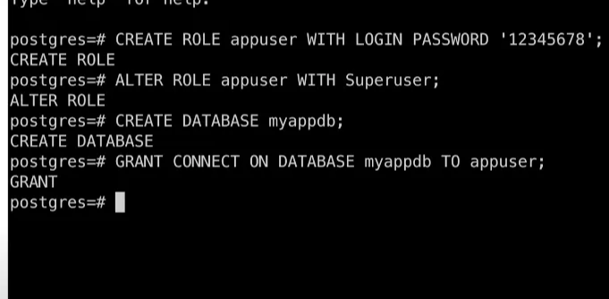
	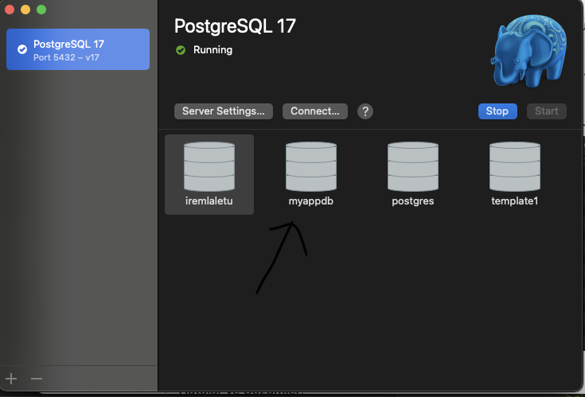
	
	* DBContext'de bu database ve user ile oluşturulan Contection String eklendi.
	* Migration işlemi başarılı bir şekilde veritabanında gerekli tabloyu oluşturuldu. İlk Post - Category - Comment Modeli ile veritabanı update edildi
	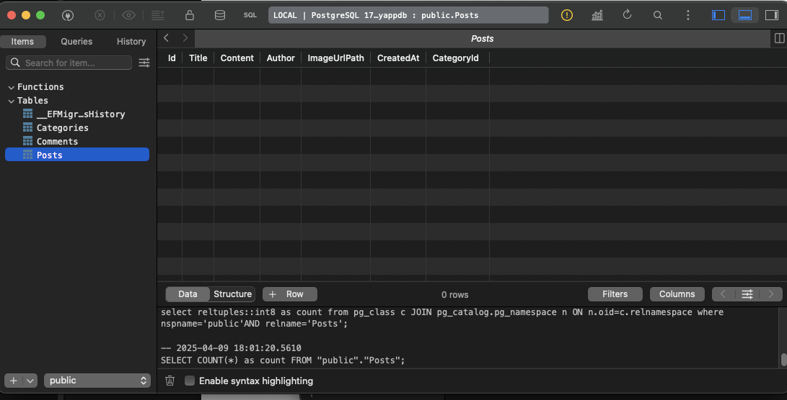

---

- **SeedData →**
	* DBContext düzenlendi ve Categories ve Posts için **seed data** tanımlandı ve seed data TablePlusta başarılı bir şekilde görüldü.
	
	* Bu migration öncesi başarısız bir migration alındı. Sebebi, HasData() içerisinde new DateTime() gibi zaman damgası içeren dinamik bir değer kullanılmasıydı. Alınan hata:

		* 'timestamp with time zone' literal cannot be generated for Unspecified DateTime: a UTC DateTime is required'
		* Çözüm olarak, tarih değeri UTC türünde sabit bir değer olarak belirtildi:
		* `new DateTime(2025, 1, 1, 0, 0, 0, 0, DateTimeKind.Utc) ` şeklinde güncellendi ve o migration remove edilip bu migration (`SeedData`) alındı ve db update edildi.
	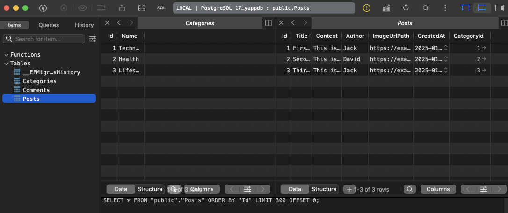

--- 

- **FixCreatedAtToUTC  →**
	* Önceki başarısız migration deneyiminden sonra tarih formatıyla ilgili problemleri tamamen ortadan kaldırmak ve CreatedAt alanlarının tutarlı şekilde UTC formatında işlenmesini garanti altına almak amacıyla alınmıştır.
	* Bu migration update sonrası da ımageUrlPath’den yüklediğim dosyanın urlsini geldiğini ve wwwroot/images klasörüne kaydettiğini de doğrulamış oldum.
	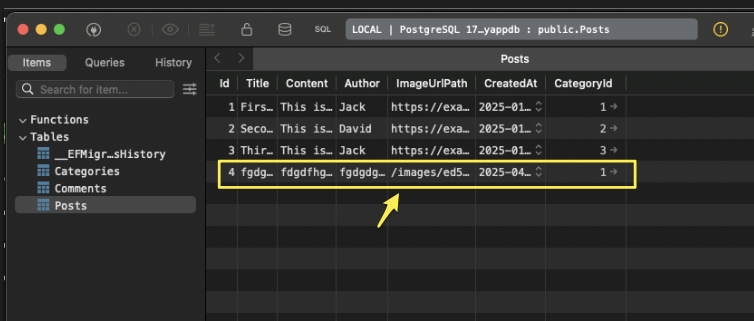

---

- **AddCreatedAtColumnToComments →**

	* Self-explanatory

---

- **CreateIdentitySchema →**
	* Bu migration ile ASP.NET Core Identity sistemine ait tablolar oluşturuldu.

	* DBContext içerisinde IdentityUser ve diğer identity tabloları için tablo isimlendirmeleri özelleştirildi
	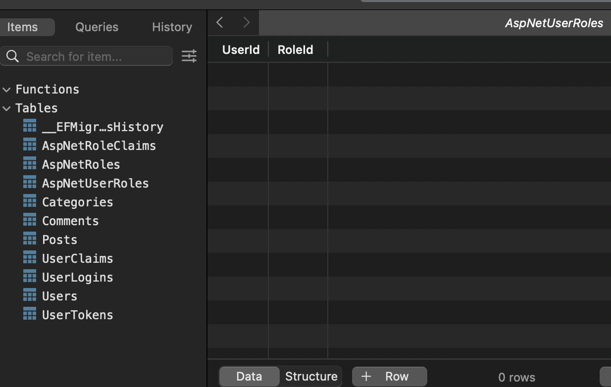

	* Bu noktada AppUser class'ı oluşturulup IdentityUser'dan türetilebilirdi. Ancak proje gereksinimleri doğrultusunda ek alan ihtiyacım olmadığı için doğrudan IdentityUser kullanmayı tercih ettim.

---

- **AddUserIdToPost →**
	* Bu migration, Post modeline UserId ilişkisinin eklenmesini veritabanına yansıtmak için oluşturulmuştur.
	* Post modeline şu alan eklendi:

	```csharp
		public string? UserId { get; set; }
		[ForeignKey("UserId")]
		public IdentityUser? User { get; set; }
	```

	* Kullanıcının oluşturduğu post ile ilişkisini kurmak amacıyla bu alan eklenmiştir.
	* Böylece bir postun hangi kullanıcıya ait olduğu takip edilebilir.
	* Controller Güncellemeleri - Post oluşturulurken ilgili alanlar aşağıdaki gibi atanacaktır:

	```csharp
	postViewModel.Post.Author = User.Identity!.Name!;
	postViewModel.Post.UserId = User.FindFirstValue(ClaimTypes.NameIdentifier)!;
	```
	* Amaç:
   		* Sadece giriş yapan kullanıcıların kendi yazılarını düzenleyebilmesini, silebilmesini sağlamak.

		* Ayrıca kullanıcıya özel dashboard gibi yapılar oluşturmak için gerekli.

---

- **MakeAuthorNunNullable →**

	* Projenin başlangıcında Post.Author alanı nullable olarak tanımlanmıştı. Ancak daha sonra kullanıcı giriş yaptıktan sonra bu alanı User.Identity.Name ile otomatik dolduracak şekilde yapılandırdım. Bu nedenle artık nullable olmasına gerek kalmadı ve alan non-nullable yapıldı.
	* Normalde Author alanı için kullanıcıdan UserName istenebilirdi. Bunun için Identity'den türeyen özel bir AppUser sınıfı oluşturup UserName gibi ek alanlarla IdentityUser yapısını genişletmek mümkündü. Ancak bu projede zaman kısıtı nedeniyle Register formunda sadece e-posta ile kayıt alınması yeterli görüldü. Böylece User.Identity.Name, doğrudan e-posta adresi olarak kullanılmaya devam etti.
	* Author alanı görünümde gizlendi ve sadece programatik olarak set ediliyor.

---

- **RemovePostSeed →**
	* Author alanı non-nullable yapıldıktan sonra, daha önce eklenen seed data kayıtlarında bu alan boş olduğu için Create işlemleri hata vermeye başladı. Bu nedenle, eski seed data kayıtları veri tabanından kaldırıldı.

---

- **MakeAuthorAgainNullable →**
	* Bu migration, Entity Framework'ün null! ifadesini yalnızca derleyici düzeyinde tanıdığı, veri tabanı şemasında ise dikkate almadığı gerçeğinden dolayı alındı. Post.Author alanı User.Identity.Name! ile doluyor olsa da, EF açısından bu alan nullable olarak işaretlenmediği sürece HasData() gibi işlemlerde null değer kabul edilmiyor.

	* Bu sebeple, Author alanı tekrar nullable yapılarak hem seed verilerle uyumlu hale getirildi hem de uygulamanın çalışma zamanında hata vermesi önlendi.

---
    
- **AddUserRelationToComment →**
 	* Comments'leri IdentityUser ile ilişkilendirmek için alındı.
	* Yani her yorumun **hangi kullanıcıya ait olduğunu** veri tabanında net bir şekilde tutmak.
	* Comments modeline bu eklendi :
	```csharp
	[ForeignKey("User")]
	public string? UserId { get; set; }
	// User objesine erişim için navigation property
	public IdentityUser? User { get; set; }
	```
	* EF Core, bu değişiklikle birlikte **yeni bir sütun** `UserId` oluşturdu ve bunu Identity tablosundaki `Users.Id` alanına bağladı `foreign key`

---

- **SeedUsersAndPostsFixed →**
	* Bu migration ile OnModelCreating metoduna seed eklendi
	* 2 tane IdentityUser
	* Her User'a 1 tane Post
	* 1.User'ın, 2.User'ın postuna 1 yorum eklendi.
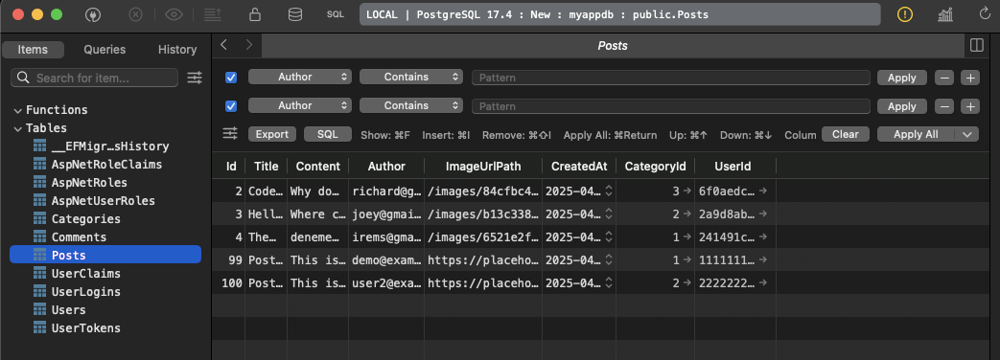
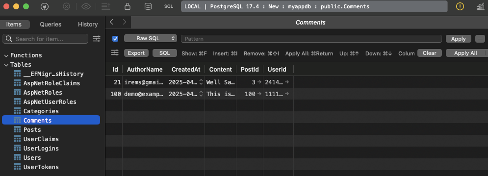
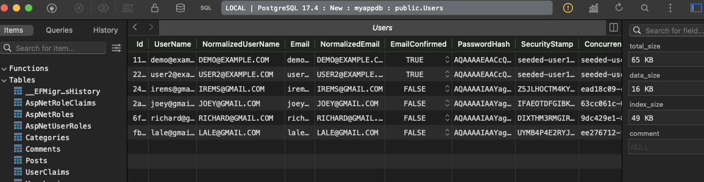
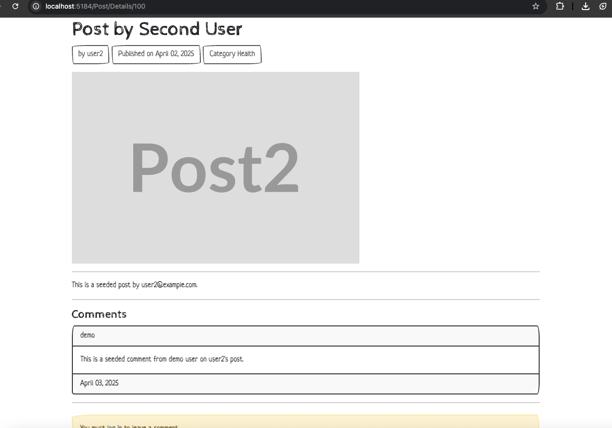